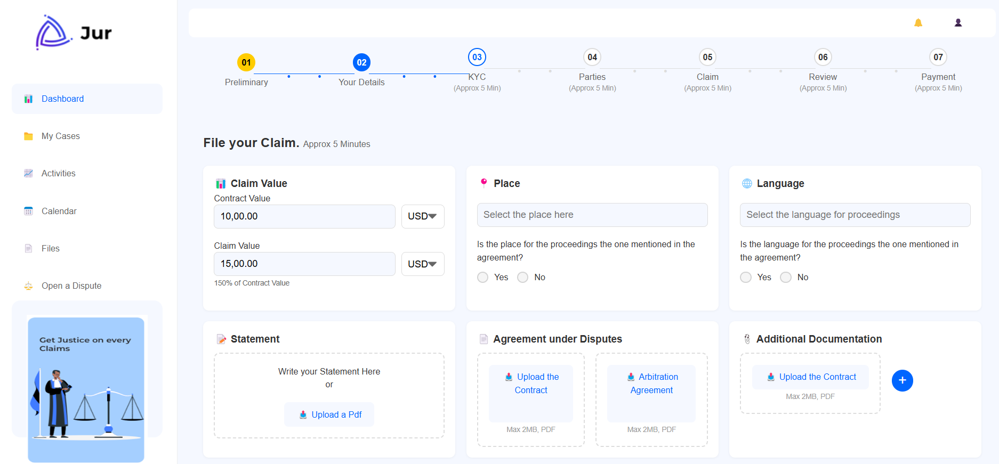
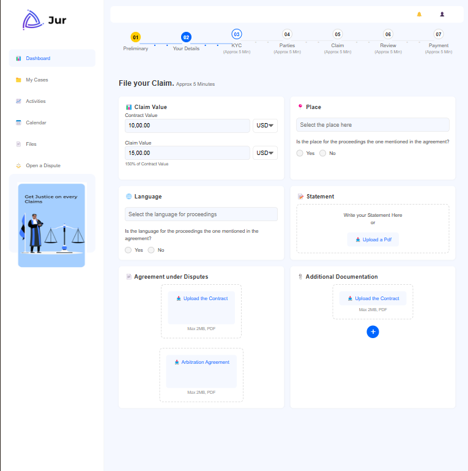
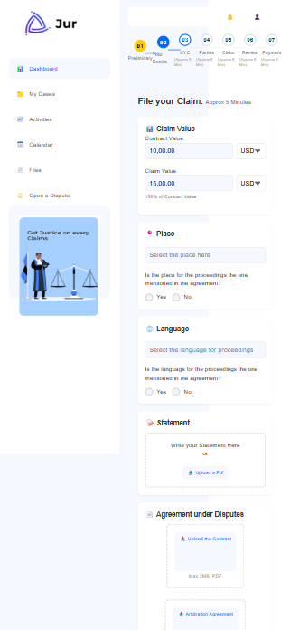

# Dashboard Implementation

## Overview
This project focuses on building a responsive dashboard using React. The dashboard guides users through a sequence of tasks (Preliminary, Your Details, KYC, Parties, Claim, Review, Payment), with a progress bar visually displaying the completion status.

## Features
- **Component-Based Architecture**: Reusable and modular components for easy maintenance and scalability.
- **Responsive Design**: Seamless functionality across desktop, tablet, and mobile devices.
- **Dynamic Task Progression**: Linear task completion with visual progress tracking.

## Approach

### 1. Component-Based Architecture
- Created reusable components such as `Navigation`, `FormSection`, and task-specific components (`ProgressBar`, `Claim`).
- Ensured each component has a single responsibility for better maintainability.

### 2. State Management
- Used React's `useState` to manage task completion states.
- Maintained an `activeStep` array to track completed tasks.
- Utilized the `setActiveStep` function to dynamically update the state and render relevant components.

### 3. Responsive Design
- Employed CSS flexbox for flexible layouts.
- Implemented media queries for adaptive styling across screen sizes.
- Tested the application on multiple devices to ensure consistency.

### 4. Dynamic Task Progression
- Enabled conditional rendering of components based on their completion status.
- Updated the `ProgressBar` to visually represent the user's progress.
- Ensured tasks are unlocked sequentially, with the next task becoming available only after the current one is completed.

## Challenges

### 1. Dynamic Rendering & State Management
- **Issue**: Managing accurate rendering and state updates.
- **Solution**: Used `activeStep` hooks and conditional rendering to ensure smooth task progression.

### 2. Responsive Design
- **Issue**: Maintaining visual appeal and usability across various devices.
- **Solution**: Adopted CSS flexbox and media queries, followed by rigorous testing on different devices.

### 3. CSS Conflicts
- **Issue**: Preventing styles from affecting unrelated components.
- **Solution**: Scoped styles using CSS modules for component isolation.

### 4. Task Completion Flow
- **Issue**: Ensuring tasks are completed sequentially.
- **Solution**: Managed task progression through state updates, locking future tasks until prerequisites are met.

## Assumptions
1. **Linear Progression**: Tasks must be completed sequentially, with the next task only accessible after completing the current one.
2. **Design Reference**: Followed the provided screenshot for layout and styling accuracy.
3. **Scope**: Focused on front-end implementation, including task interactions and layouts, without backend integration or advanced validation.

## Screenshots

### Desktop View


### Tablet View


### Mobile View


## Instructions to Run

### 1. Clone the Repository
```bash
git clone https://github.com/28kartik07/Rise_11-dashboard.git
cd Rise_11-dashboard
npm install
npm run dev